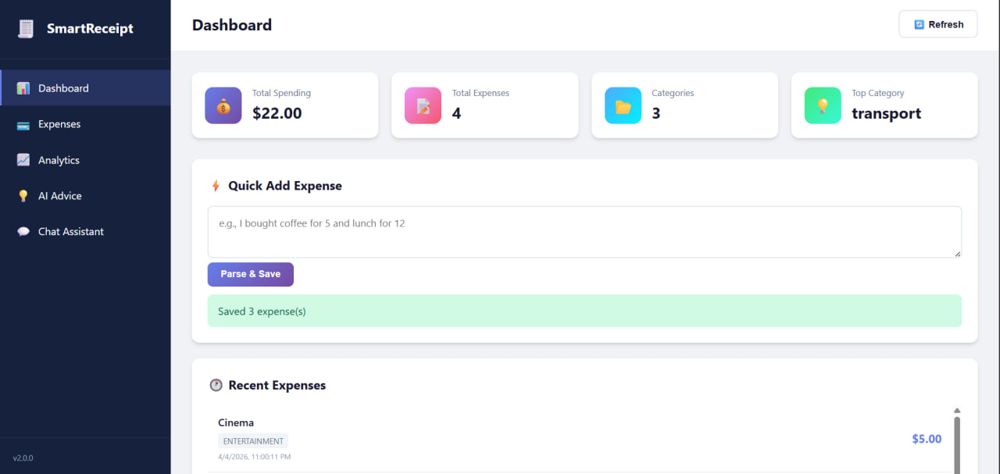
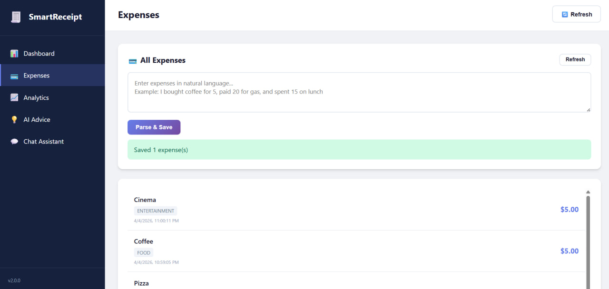
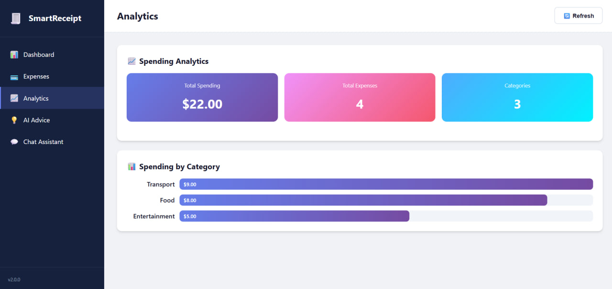
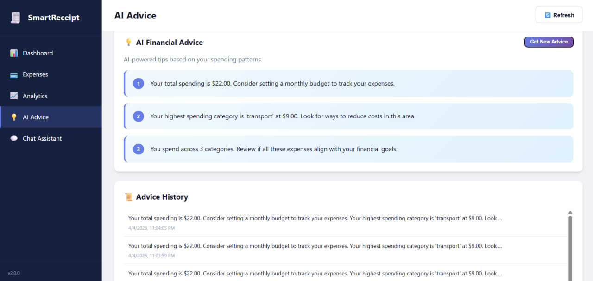
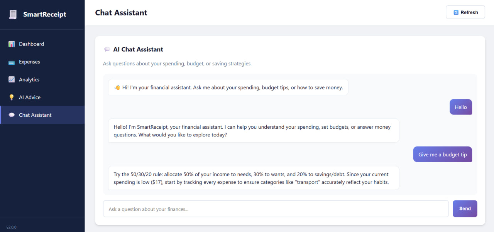

# 🧾 SmartReceipt — AI-Powered Financial Assistant

**Version 2.0** — A full-stack AI financial assistant accessible via Telegram bot and web dashboard.

---

## 📸 Demo

> 
> 
> 
> 
> 

---

## 🧠 Product Description

SmartReceipt is an **AI-powered financial assistant** that lets users track expenses using natural language and receive personalized financial insights. Whether through a **Telegram bot** or a modern **web dashboard**, users can log spending, view analytics, get AI-generated tips, and chat with an intelligent financial assistant.

### Target Users
Students and young professionals who want a simple, fast, and intelligent way to track and understand their spending.

### Problem
Manual expense tracking is tedious. Most people don't track spending because existing tools are too complex.

### Solution
Just type your expenses naturally — SmartReceipt uses AI to extract, categorize, and analyze them automatically, then provides actionable financial advice.

---

## ✨ Features

### Version 1 (Foundation)
- ✅ Telegram bot for logging expenses via chat
- ✅ Web interface for submitting and viewing expenses
- ✅ AI-powered parsing of natural language input
- ✅ Automatic categorization of expenses
- ✅ Persistent SQLite storage
- ✅ REST API (FastAPI backend)

### Version 2 (Full AI Assistant)
- 🤖 **AI Financial Advisor** — Personalized spending tips based on your data
- 💬 **Chat Assistant** — Conversational AI that answers questions about your finances
- 📊 **Spending Analytics** — Total spending and breakdown by category
- 📜 **Advice History** — All generated tips saved for reference
- 💭 **Chat Memory** — Conversation context maintained across messages
- 🌐 **Full Web Dashboard** — Dashboard, analytics view, advice section, chat interface
- 🐳 **Dockerized** — One-command deployment with docker-compose

---

## 🏗 Architecture

```
SmartReceipt/
├── backend/
│   ├── main.py              # FastAPI app + all endpoints
│   ├── database.py          # SQLite with all tables
│   ├── llm_parser.py        # Expense extraction from text
│   ├── llm_advisor.py       # Financial advice generation
│   └── llm_chat.py          # Conversational chat assistant
├── bot/
│   └── telegram_bot.py      # Telegram bot with /stats, /advice, /chat
├── frontend/
│   ├── index.html           # Dashboard SPA
│   ├── styles.css           # Modern responsive styles
│   └── app.js               # Frontend logic
├── Dockerfile.backend       # Backend container
├── Dockerfile.bot           # Bot container
├── Dockerfile.frontend      # Nginx frontend container
├── docker-compose.yml       # Orchestration
├── nginx.conf               # Nginx reverse proxy config
├── requirements.txt         # Python dependencies
└── .env.example             # Environment variables template
```

---

## 🚀 Usage

### Telegram Bot

| Command | Description |
|---------|-------------|
| `/start` | Welcome message with instructions |
| `/stats` | View spending analytics (total + by category) |
| `/advice` | Get 3 AI-generated financial tips |
| `/chat` | Enter chat mode — ask questions about your finances |
| `/exit` | Exit chat mode |

**Log an expense:**
```
I bought coffee for 5 and pizza for 10
```

**Bot replies:**
```
✅ Saved:
• coffee: 5 (food)
• pizza: 10 (food)
```

**Chat mode examples:**
```
Where do I spend the most?
How can I save money?
What's my total spending?
Give me a budget tip
```

---

### Web Dashboard

Access at `http://localhost:3000` (Docker) or `http://localhost:8000` (direct).

**5 Sections:**

1. **Dashboard** — Overview cards (total, count, categories, top category) + quick add + recent expenses
2. **Expenses** — Full expense list with natural language input
3. **Analytics** — Total spending + visual category breakdown with bar charts
4. **AI Advice** — Generated financial tips + advice history
5. **Chat Assistant** — Real-time chat interface with AI financial assistant

---

## 🔧 Local Development Setup

### Requirements
- Python 3.10+
- (Optional) OpenAI-compatible API key for AI features

### Installation

```bash
git clone https://github.com/shefyo/se-toolkit-hackathon
cd se-toolkit-hackathon

python -m venv venv
source venv/bin/activate    # Linux/Mac
venv\Scripts\activate       # Windows

pip install -r requirements.txt
```

### Environment Variables

```bash
cp .env.example .env
# Edit .env with your values
```

| Variable | Description |
|----------|-------------|
| `TELEGRAM_BOT_TOKEN` | Telegram bot token from @BotFather |
| `LLM_API_KEY` | OpenAI-compatible API key |
| `LLM_BASE_URL` | API base URL (default: OpenAI) |
| `LLM_MODEL` | Model name (default: gpt-3.5-turbo) |
| `BACKEND_URL` | Backend URL (for bot) |

> **Note:** Without an LLM API key, the system falls back to rule-based parsing and generic advice.

### Run Application

**Backend:**
```bash
uvicorn backend.main:app --host 0.0.0.0 --port 8000 --reload
```

**Telegram Bot:**
```bash
BACKEND_URL=http://localhost:8000 python -m bot.telegram_bot
```

**Web Frontend:**
Open `http://localhost:8000` in your browser (served by FastAPI).

---

## 🌐 API Reference

| Method | Endpoint | Description |
|--------|----------|-------------|
| `POST` | `/parse-expenses` | Parse and save expenses from text |
| `GET` | `/expenses` | Get all stored expenses |
| `GET` | `/stats` | Get spending analytics (total + by category) |
| `GET` | `/advice` | Generate AI financial advice (3 tips) |
| `GET` | `/advice/history` | Get advice history |
| `POST` | `/chat` | Chat with AI financial assistant |
| `GET` | `/chat/history` | Get chat message history |
| `GET` | `/health` | Health check |

### Request/Response Examples

**POST /parse-expenses**
```json
{"text": "I bought coffee for 5 and paid 20 for gas"}
```

**GET /stats**
```json
{
  "total": 125.50,
  "by_category": {"food": 45.00, "transport": 80.50},
  "expense_count": 5
}
```

**POST /chat**
```json
{"message": "Where do I spend the most?"}
```

---

## 🗄 Database

SQLite database with 3 tables:

### expenses
| Column | Type | Description |
|--------|------|-------------|
| id | INTEGER | Primary key |
| item | TEXT | Expense name |
| amount | REAL | Cost amount |
| category | TEXT | Category |
| created_at | TIMESTAMP | Creation time |

### advice_history
| Column | Type | Description |
|--------|------|-------------|
| id | INTEGER | Primary key |
| content | TEXT | Advice text |
| created_at | TIMESTAMP | Creation time |

### chat_messages
| Column | Type | Description |
|--------|------|-------------|
| id | INTEGER | Primary key |
| user_message | TEXT | User's message |
| bot_response | TEXT | AI's response |
| created_at | TIMESTAMP | Creation time |

---

## 🐳 Docker Deployment

### Quick Start

```bash
# 1. Clone
git clone https://github.com/shefyo/se-toolkit-hackathon
cd se-toolkit-hackathon

# 2. Configure
cp .env.example .env
nano .env  # Add your API keys

# 3. Deploy
docker-compose up --build -d

# 4. Access
# Web:    http://<VM_IP>:3000
# API:    http://<VM_IP>:8000/docs
```

### Services

| Service | Port | Description |
|---------|------|-------------|
| frontend | 3000 | Web dashboard (nginx) |
| backend | 8000 | FastAPI REST API |
| bot | — | Telegram bot (no exposed port) |

### Useful Commands

```bash
docker-compose up --build -d   # Start all services
docker-compose down             # Stop all services
docker-compose logs -f bot      # View bot logs
docker-compose logs -f backend  # View backend logs
docker-compose restart bot      # Restart bot only
```

---

## 📋 Deployment on Ubuntu 24.04

See [DEPLOY.md](DEPLOY.md) for detailed step-by-step instructions.

**Quick version:**

```bash
# Install Docker
sudo apt update && sudo apt install -y docker.io docker-compose
sudo systemctl enable --now docker

# Deploy
git clone <repo-url>
cd se-toolkit-hackathon
cp .env.example .env
# Edit .env with your tokens
docker-compose up --build -d
```

> **Note:** Telegram bots are blocked on some university VMs. Run the bot locally while deploying backend + frontend on the VM.

---

## 🔐 Environment Variables

| Variable | Required | Default | Description |
|----------|----------|---------|-------------|
| `TELEGRAM_BOT_TOKEN` | Yes (for bot) | — | From @BotFather |
| `LLM_API_KEY` | No | — | OpenAI-compatible API key |
| `LLM_BASE_URL` | No | `https://openrouter.ai/api/v1` | API endpoint |
| `LLM_MODEL` | No | `stepfun/step-3.5-flash:free` | Model name |
| `BACKEND_URL` | Yes (for bot) | `http://localhost:8000` | Backend URL |

---

## 📌 Summary

SmartReceipt combines:
- 🗣 **Natural language input** — Just type your expenses
- 🤖 **AI-powered parsing** — LLM extracts and categorizes
- 📊 **Spending analytics** — Visual breakdown by category
- 💡 **AI financial advice** — Personalized tips
- 💬 **Chat assistant** — Conversational financial helper
- 🌐 **Multi-interface** — Telegram bot + web dashboard
- 🐳 **One-command deploy** — Docker + docker-compose

Into one lightweight, intelligent, and user-friendly financial system.
